# TCLab — State-Space Control & System Identification

A portfolio reconstruction of selected TCLab work developed at TU Hamburg, combining **observer-based state-feedback control** with **linear and nonlinear system identification** of a two-heater thermal plant.

## Overview

The project contains two complementary parts:

### 1. Observer-Based State-Space Control

- Discrete-time state-space modeling of the TCLab
- Controlled equilibrium calculation
- Controllability and observability verification
- State-feedback pole placement
- Discrete Luenberger observer design
- Simulation with measurement noise
- Real-time implementation on physical TCLab hardware
- Heater saturation and temperature safety handling
- Observer and tracking-error analysis

### 2. Linear & Nonlinear System Identification

- Experimental data calibration using measured ambient temperature
- MOESP subspace identification
- Model-order evaluation using validation-data MSE
- Linear state-space model validation
- Degree-2 polynomial-kernel regression
- Regularized kernel model identification
- Validation of nonlinear predictions
- Comparison of identified models against newly collected real-plant measurements

## Project Architecture

See [`docs/architecture.md`](docs/architecture.md) for the control and identification workflows.

## Results

### State-feedback control

#### Simulation — output temperatures and heater inputs

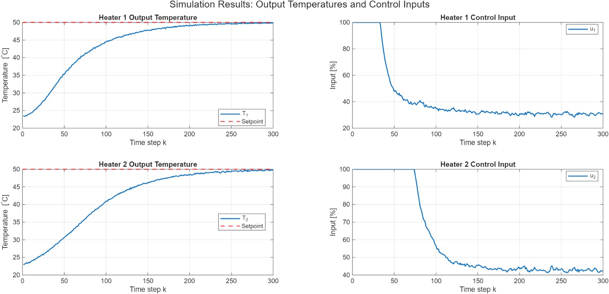

#### Simulation — observer and tracking errors

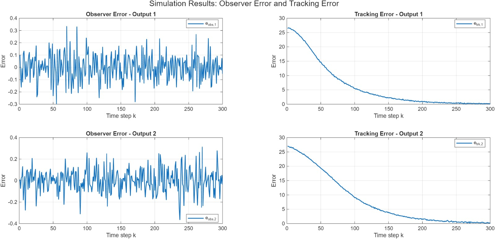

#### Real hardware — output temperatures and heater inputs

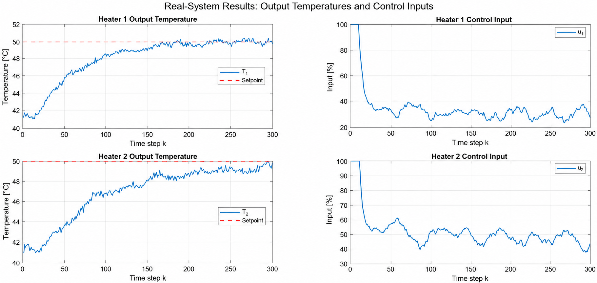

#### Real hardware — observer and tracking errors

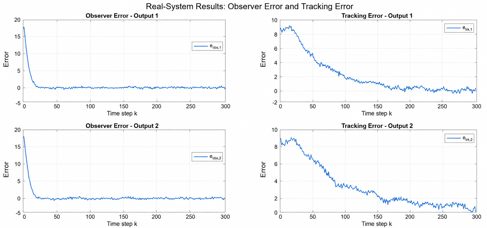

The controller was evaluated at a 50 °C temperature setpoint in both simulation and on the physical TCLab. The results include output temperatures, heater inputs, observer errors, and tracking errors. The hardware controller was subsequently retuned for the physical plant.

### System identification

#### Training and validation data

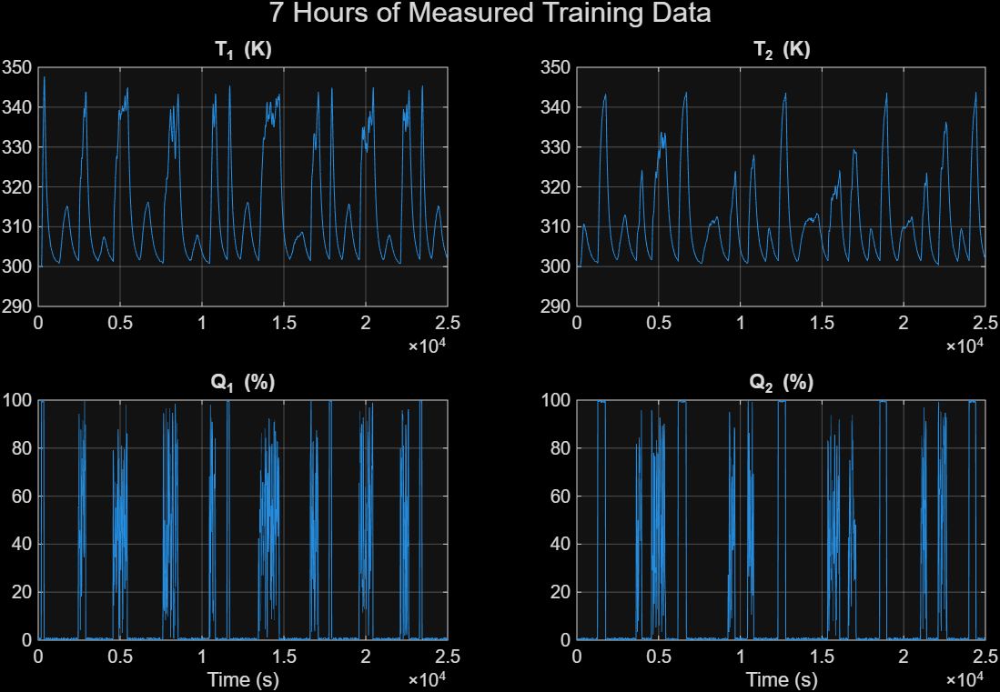

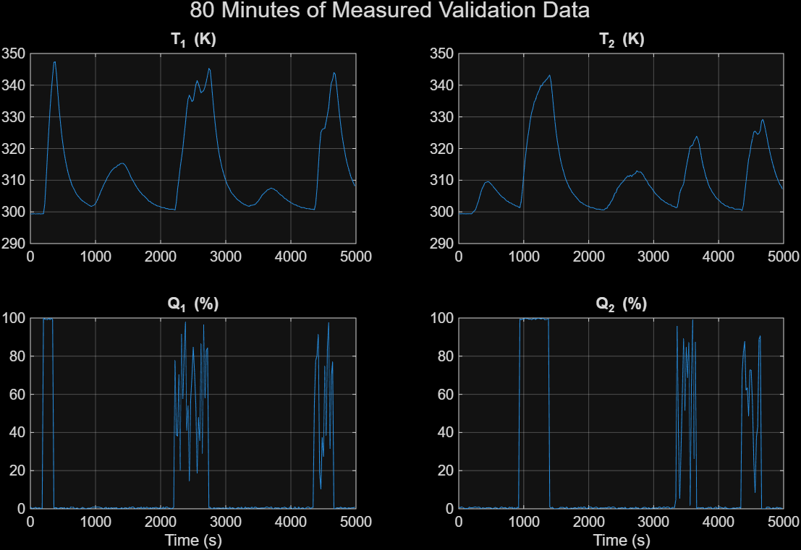

#### MOESP singular values

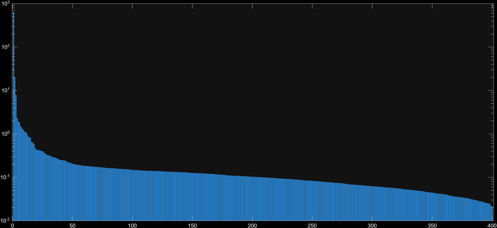

#### Linear model-order evaluation

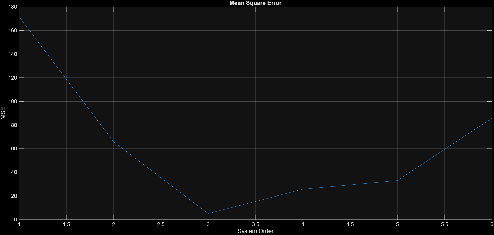

#### Linear model validation

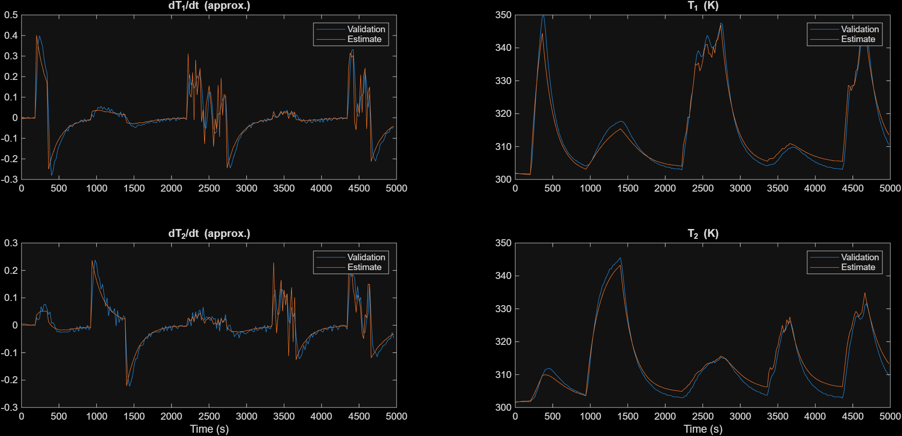

#### Nonlinear kernel-model validation

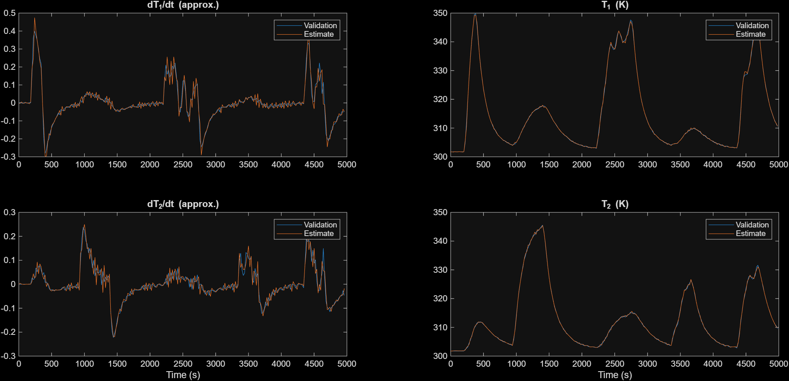

#### Identified models vs. real-plant measurements

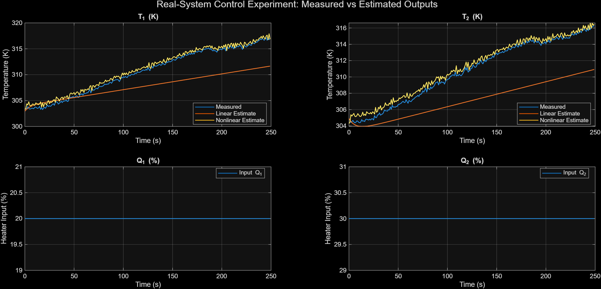

## Technical Details

### State-feedback control

The controller uses

\[
u_k = \bar{u} - K(\hat{x}_k-\bar{x})
\]

with a discrete Luenberger observer

\[
\hat{x}_{k+1}=A\hat{x}_k+B u_k+L(y_k-\hat{y}_k),
\qquad
\hat{y}_k=C\hat{x}_k+D u_k.
\]

The controller and observer gains are obtained by pole placement. MATLAB's `place` method assigns the desired closed-loop poles for controllable/observable state-space models. 

### System identification

The linear identification stage uses MOESP subspace identification. The nonlinear stage uses a degree-2 polynomial kernel with temperature-history components centered around the measured ambient temperature, followed by regularized least-squares estimation of the kernel weights.

## Repository Structure

```text
TCLab-State-Space-Control/
├── README.md
├── .gitignore
├── docs/
│   └── architecture.md
├── src/
│   ├── control/
│   │   └── observer_state_feedback.m
│   ├── identification/
│   │   ├── d2m1_system_identification.m
│   │   ├── f_next.m
│   │   ├── gram_matrix.m
│   │   ├── kernel.m
│   │   ├── moesp.m
│   │   ├── observability_matrix.m
│   │   └── toeplitz_tril.m
│   └── experiments/
│       ├── run_state_feedback.m
│       └── run_system_identification.m
└── results/
    ├── state-feedback/
    └── system-identification/
```

## Hardware / External Dependencies

The control experiment was executed on a physical TCLab. The repository does **not** include the TCLab hardware communication driver or course-provided datasets. Those components are intentionally kept outside the portfolio repository.

The identification scripts therefore require a compatible `data.mat` dataset to reproduce the offline identification workflow. The hardware control script additionally requires the TCLab interface used during the laboratory experiment.

## Attribution

This repository is a cleaned portfolio reconstruction of selected work completed during the Control Lab at TU Hamburg. Course-provided and reference components remain attributed to their original authors where applicable. In particular, `src/identification/moesp.m` is attributed in its source header to Guanru Pan, TUHH ICS. The repository does not claim authorship of course-provided hardware interfaces or reference implementations.

## Course Context

This repository is a cleaned portfolio reconstruction of selected implementations developed during the **Control Lab at TU Hamburg**. Course questionnaires, student identifiers, raw datasets, local MATLAB files, and course-provided hardware infrastructure are intentionally excluded.

The repository focuses on the engineering work: state-space control, state estimation, system identification, validation, and experimental results.
